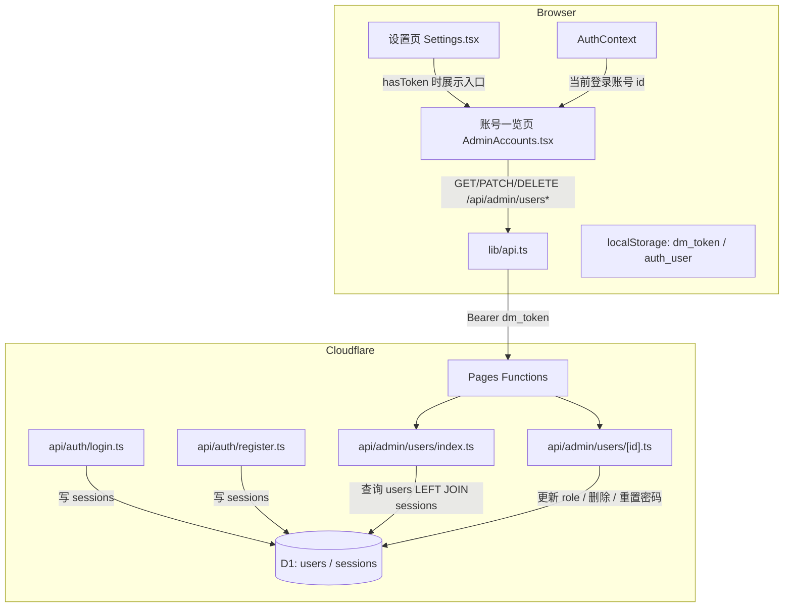

# 账号一览页面（Account Overview）

Feature Name: account-overview
Updated: 2026-08-01

## Description

在设置页 `/settings` 中新增「账号一览」入口（仅本地存在 DM Token 时展示），进入 `/settings/accounts` 后为网站管理员提供全部注册账号的管理视图。列表展示每个账号的名称、ID、权限（玩家/DM）、身份（成员/管理员）与登录状态，并支持修改权限、删除账号、重置密码等管理操作。

三个关键设计决策：

1. **身份为派生属性**：身份不持久化存储。持有有效 DM Token 且已通过管理员认证的当前登录账号身份为「管理员」，其余账号均为「成员」。判定由前端完成（当前登录用户 id + DM Token 验证状态）。
2. **登录状态基于 JWT 有效期推算**：新增 `sessions` 表，登录/注册时写入该账号最近一次签发的 JWT 过期时间；在线 = 存在记录且 `exp > now`。不做实时在线跟踪，登出视为清除会话记录。
3. **管理操作受 DM Token 保护**：所有账号管理端点仅校验 `DM_TOKEN` 环境变量（`verifyDmToken`），不依赖账号 JWT。

## Architecture



## Components and Interfaces

### 后端 API

所有端点均先校验 `Authorization: Bearer <token>` 与 `env.DM_TOKEN` 一致，失败返回 401。使用现有 `verifyDmToken(request, env)` 工具。

| 方法 | 路径 | 说明 | 请求体 | 成功响应 |
|------|------|------|--------|----------|
| GET | `/api/admin/users` | 列出全部账号 | 无 | `{ users: UserRow[] }` |
| PATCH | `/api/admin/users/:id` | 修改权限（role） | `{ role: 'player' \| 'dm' }` | `{ ok: true }` |
| DELETE | `/api/admin/users/:id` | 删除账号 | 无 | `{ ok: true }` |
| POST | `/api/admin/users/:id/password` | 重置密码 | `{ password: string }` | `{ ok: true }` |

`UserRow` 结构：

```typescript
interface UserRow {
  id: string;
  username: string;
  role: 'player' | 'dm';
  createdAt: number;
  online: boolean; // sessions 表存在且 exp > now
}
```

`GET /api/admin/users` 的 SQL 逻辑：

```sql
SELECT u.id, u.username, u.role, u.created_at,
       (s.exp IS NOT NULL AND s.exp > ?1) AS online
FROM users u
LEFT JOIN sessions s ON s.user_id = u.id
ORDER BY u.created_at ASC;
```

### 前端页面

**新增 `src/pages/AdminAccounts.tsx`**：账号一览主页面。

- 挂载时调用 `api.fetchAdminUsers()`，带 DM Token 请求头；401 时清除本地 token 并跳转 `/settings/admin`
- 状态：`users`、`loading`、`error`、`activeModal`（当前操作弹窗）
- 身份列判定：`account.id === currentUser.id && hasVerifiedDmToken` → 「管理员」，否则「成员」
- 登录状态列：`account.online` → 「在线」/「离线」
- 操作列按钮：修改权限（弹窗选 玩家/DM）、删除（二次确认）、重置密码（输入新密码）
- 自我保护：目标账号为管理员本人时禁用删除；本人权限修改由后端拒绝

**修改 `src/pages/Settings.tsx`**：

- `NAV_ITEMS` 新增一项：`{ path: '/settings/accounts', icon: Users, label: '账号一览', description: '查看并管理注册账号' }`
- 现有渲染逻辑已按 `hasToken` 条件展示卡片列表，无需改动；入口自动仅对持有 DM Token 者可见

**修改 `src/App.tsx`**：

- `Settings` 嵌套路由新增 `<Route path="accounts" element={<AdminAccounts />} />`

**修改 `src/lib/api.ts`**：

新增四个函数，均通过现有 `apiFetch` 携带 DM Token（`authHeaders` 会优先 JWT，但管理端点只认 DM Token；需显式传 DM Token 头）：

```typescript
export async function fetchAdminUsers(): Promise<{ users: any[] }>
export async function updateUserRole(id: string, role: string): Promise<{ ok: true }>
export async function deleteAdminUser(id: string): Promise<{ ok: true }>
export async function resetUserPassword(id: string, password: string): Promise<{ ok: true }>
```

### 会话写入

**修改 `functions/api/auth/login.ts` 与 `functions/api/auth/register.ts`**：

登录/注册成功后，将 JWT 过期时间写入 sessions 表（`exp = iat + 604800`，与 `signJwt` 一致）：

```sql
INSERT OR REPLACE INTO sessions (user_id, token_hash, exp, updated_at) VALUES (?, ?, ?, ?)
```

## Data Models

### 新增 `sessions` 表（migrations/0002_sessions.sql）

```sql
CREATE TABLE IF NOT EXISTS sessions (
  user_id TEXT PRIMARY KEY,
  token_hash TEXT NOT NULL,
  exp INTEGER NOT NULL,
  updated_at INTEGER NOT NULL
);

CREATE INDEX IF NOT EXISTS idx_sessions_exp ON sessions(exp);
```

- 每账号一条记录（`user_id` 主键），登录/注册时覆盖
- `token_hash` 存 JWT 的 SHA-256 摘要，不存明文
- `exp` 为该账号最近一次签发 JWT 的过期时间戳（ms）

### 现有 `users` 表

字段 `id`、`username`、`password_hash`、`role`、`created_at`，仅新增只读查询，不做结构变更。

## Correctness Properties

1. **只读展示字段正确性**：列表五个字段（名称、ID、权限、身份、登录状态）由后端 `UserRow` + 前端身份判定组合得出，语义明确
2. **管理员自我保护**：删除账号时，IF 目标账号 id 等于当前请求者登录账号，系统 SHALL 拒绝（返回 400）
3. **权限值域约束**：`role` 仅接受 `'player'` 或 `'dm'`，其余返回 400
4. **密码强度约束**：重置密码接口要求新密码长度 >= 6，与注册接口规则一致
5. **DM Token 唯一访问途径**：所有管理端点仅接受 `DM_TOKEN` 匹配的 Bearer Token；JWT 请求一律 401
6. **会话一致性**：删除账号时级联删除其 sessions 记录，避免孤儿会话

## Error Handling

| 场景 | 处理 |
|------|------|
| 未携带或携带无效 DM Token | 后端返回 401；前端清除本地 token 并跳转 `/settings/admin` |
| 删除管理员本人账号 | 后端返回 400「不能删除当前管理员账号」；前端弹窗提示 |
| 传入非法 role 值 | 后端返回 400「无效的权限值」 |
| 密码长度不足 6 位 | 后端返回 400；前端输入框校验并提示 |
| 目标账号不存在 | 后端返回 404「账号不存在」 |
| 网络异常 / 后端 500 | 前端展示错误提示并提供「重试」按钮 |

## Test Strategy

1. **后端单端点验证（本地 wrangler / 部署后手动）**：
   - `GET /api/admin/users`：无 token → 401；错 token → 401；正确 token → 200 返回全部账号
   - `PATCH /api/admin/users/:id`：改 role 后列表可见；非法 role → 400
   - `DELETE /api/admin/users/:id`：删除后列表减少；删除本人 → 400
   - `POST /api/admin/users/:id/password`：重置后旧密码登录失败、新密码可登录
2. **前端手工验证**：
   - 无 DM Token 时设置页不显示「账号一览」入口；有 token 时显示并可进入
   - 列表正确展示名称/ID/权限/身份/登录状态；本人身份为「管理员」，其余为「成员」
   - 修改权限 / 删除 / 重置密码操作流程完整，成功后列表刷新
   - 登录一个账号后，该账号在列表中显示「在线」；等待或登出后显示「离线」
3. **回归验证**：`npx tsc -b` 与 `npm run build` 通过；原有登录/注册/设置页功能不受影响

## References

[^1]: (Filename) - [src/pages/Settings.tsx](src/pages/Settings.tsx) - 设置页导航入口
[^2]: (Filename) - [src/lib/api.ts](src/lib/api.ts) - API 客户端与 DM Token 请求头
[^3]: (Filename) - [functions/_utils.ts](functions/_utils.ts) - `verifyDmToken` / `authenticateRequest` 认证工具
[^4]: (Filename) - [functions/api/auth/login.ts](functions/api/auth/login.ts) - 登录端点（写 sessions）
[^5]: (Filename) - [functions/api/auth/register.ts](functions/api/auth/register.ts) - 注册端点（写 sessions）
[^6]: (Filename) - [src/contexts/AuthContext.tsx](src/contexts/AuthContext.tsx) - 当前登录账号上下文
