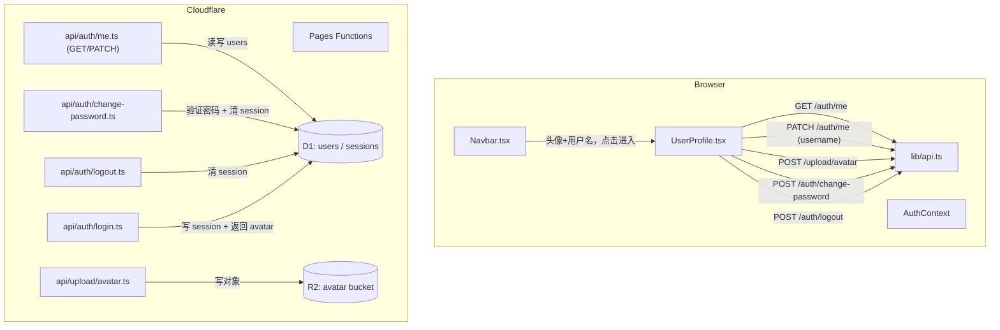

# 用户账号页与顶栏用户信息（User Profile & Navbar User Info）

Feature Name: account-profile
Updated: 2026-08-01

## Description

顶栏删除 DM 端的导入/导出按钮，改为展示当前登录用户的头像 + 用户名（点击进入账号页）。新增用户账号页 `/account`：顶部居中展示圆形头像与用户名（右上角编辑按钮），下方陈列 ID（浅色）、用户权限（成员/管理员）、用户类型（玩家/DM），并提供修改密码（原/新/确认）与退出登录。

三个关键设计决策：

1. **头像存 R2**：`users.avatar` 存图片 URL。上传端点接收图片字节，写入 R2 bucket，返回公开 URL。
2. **强制重新登录（改密）**：修改密码成功后清空该账号 session 记录并退出登录，引导用新密码重新登录。
3. **退出登录同步会话**：新增 logout 端点清除该账号 session，使账号一览页「在线」状态正确失效。

## Architecture



## Components and Interfaces

### 后端 API

| 方法 | 路径 | 认证 | 请求体 | 说明 |
|------|------|------|--------|------|
| GET | `/api/auth/me` | JWT | 无 | 返回当前用户（含 `avatar`） |
| PATCH | `/api/auth/me` | JWT | `{ username?: string, avatar?: string }` | 更新用户名/头像；用户名需校验唯一与长度 |
| POST | `/api/auth/change-password` | JWT | `{ oldPassword, newPassword }` | 验证原密码，更新哈希，清 session |
| POST | `/api/auth/logout` | JWT | 无 | 删除该账号 session 记录 |
| POST | `/api/upload/avatar` | JWT | 图片二进制 body | 写 R2，返回 `{ url }` |
| POST | `/api/auth/login` | 无 | `{ username, password }` | 响应 user 增加 `avatar` 字段 |
| POST | `/api/auth/register` | 无 | `{ username, password, role }` | 响应 user 增加 `avatar` 字段 |

**PATCH `/api/auth/me` 校验规则**：

- `username`：非空、`trim().length >= 2`、不与其它账号重复（排除自己）；任一不满足返回 400
- `avatar`：非空字符串，作为已上传的 R2 URL 写入
- 只提交存在字段；两者皆无时返回 400

**POST `/api/auth/change-password` 校验规则**：

- `oldPassword` 验证失败 → 401「原密码错误」
- `newPassword.length < 6` → 400「新密码长度至少 6 位」
- 成功后：`UPDATE users SET password_hash` + `DELETE FROM sessions WHERE user_id = ?`

### R2 配置

`wrangler.toml` 新增绑定（需在 Cloudflare Dashboard 创建 bucket 并配置公开访问域名）：

```toml
[[r2_buckets]]
binding = "AVATAR_BUCKET"
bucket_name = "dnd-new-avatars"
```

上传端点逻辑：`await request.arrayBuffer()` → `env.AVATAR_BUCKET.put(key, bytes, { httpMetadata: { contentType } })`，`key = avatars/${userId}-${Date.now()}.${ext}`，返回 `{ url: \`${R2_PUBLIC_URL}/${key}\` }`（`R2_PUBLIC_URL` 为环境变量，形如 `https://pub-<id>.r2.dev`）。

### 前端

**`src/lib/api.ts`** 新增：

```typescript
export function fetchCurrentUser() // 已有，扩展 avatar
export function updateProfile(data: { username?: string; avatar?: string }): Promise<{ user: User }>
export function changePassword(oldPassword: string, newPassword: string): Promise<{ ok: true }>
export function uploadAvatar(file: Blob): Promise<{ url: string }>
export function logoutUser(): Promise<{ ok: true }>
```

**`src/contexts/AuthContext.tsx`**：

- `User` 接口增加 `avatar?: string`
- 新增 `updateUser(partial)`：合并更新 `user` state 与 `localStorage['auth_user']`
- 新增 `clearSession`（退出登录）：清除本地 `auth_token`/`auth_user` 并 `setUser(null)`

**`src/components/Navbar.tsx`**：

- 删除 `handleImport`/`handleExport`、`Upload`/`Download` 按钮及对应 lucide 导入
- 引入 `useAuth` 与 `useNavigate`；在工具栏末尾（主题切换前）新增用户信息入口：圆形头像（`user.avatar`，无则默认头像图标）+ 用户名，点击 `navigate('/account')`

**`src/pages/UserProfile.tsx`**（新建）：

- 布局：顶部居中 圆形头像（96px）+ 用户名；头像右上角悬浮编辑小按钮
- 编辑弹窗：头像上传（`<input type="file">` → 压缩到 256px → `uploadAvatar` → 更新预览）+ 用户名输入 + 保存（`updateProfile`）
- 信息区：ID（浅色字）、权限（成员/管理员，`isVerifiedAdmin` 派生）、用户类型（玩家/DM，`user.role`）
- 修改密码区：原密码 / 新密码 / 确认新密码三输入框 + 提交；成功后调用 `clearSession` 并跳转 `/login`
- 底部：退出登录按钮（`logoutUser` + `clearSession` + 跳转 `/login`）
- 挂载时 `fetchCurrentUser()` 刷新最新资料

**`src/App.tsx`**：

- DM 端 `Layout` 组新增 `<Route path="account" element={<UserProfile />} />`
- 玩家端 `PlayerLayout` 组新增 `<Route path="account" element={<UserProfile />} />`

## Data Models

### `users` 表变更（migrations/0003_avatar.sql）

```sql
ALTER TABLE users ADD COLUMN avatar TEXT;
```

- `avatar`：头像 R2 URL（可为 NULL），未上传时前端显示默认头像

### 现有 `sessions` 表

不变，用于 logout / change-password 清除会话。

## Correctness Properties

1. **用户名唯一性**：PATCH 更新用户名时，IF 新用户名已属于其它账号，系统 SHALL 拒绝（返回 400）
2. **输入校验一致性**：用户名长度 >= 2、密码长度 >= 6，与注册接口规则一致
3. **权限派生规则**：权限（成员/管理员）由「当前账号是否为 DM Token 持有者」派生，IF 已验证 DM Token，则权限为管理员，否则为成员
4. **会话一致性**：改密与退出登录均删除该账号 session，账号一览页在线状态即时失效
5. **安全**：上传端点为 R2 对象设置合理的 Content-Type；上传路径含用户 ID 隔离；`avatar` 仅接受上传端点返回的 URL 格式（前缀校验）
6. **顶栏可访问性**：DM 端与玩家端均显示用户信息入口，两端的 `/account` 路由指向同一页面

## Error Handling

| 场景 | 处理 |
|------|------|
| 用户名重复 / 过短 | 前端校验 + 后端 400，弹窗内提示，不提交 |
| 原密码错误 | 后端 401「原密码错误」，页面提示 |
| 新密码与确认不一致 / 过短 | 前端校验提示，不提交 |
| 未登录访问 `/account` | ProtectedRoute 拦截跳转登录页 |
| 上传失败 / R2 不可用 | 前端提示上传失败，保留当前头像 |
| 修改密码成功后 | 清会话并跳转登录页，提示用新密码登录 |

## Test Strategy

1. **后端验证（wrangler dev / 部署后）**：
   - `PATCH /api/auth/me`：改用户名成功且列表更新；重复用户名 → 400；过短 → 400
   - `POST /api/auth/change-password`：原密码错误 → 401；成功后旧密码无法登录、新密码可登录；session 被清除（账号一览显示离线）
   - `POST /api/upload/avatar`：上传后 R2 存在对象且返回可访问 URL
   - `POST /api/auth/logout`：session 清除，账号一览显示离线
2. **前端手工验证**：
   - 顶栏无导入/导出按钮，显示头像 + 用户名，点击进入账号页
   - 未上传头像显示默认头像；上传后显示新头像（刷新后仍保留）
   - 编辑弹窗修改用户名成功并反映到顶栏
   - 修改密码流程：原密码错 → 报错；成功后跳登录页，新密码可登录
   - 退出登录 → 回到登录页，刷新后仍为未登录
3. **回归验证**：`npx tsc -b` 与 `npm run build` 通过；角色卡导入导出入口仍可通过其它位置访问（如有）

## References

[^1]: (Filename) - [src/components/Navbar.tsx](src/components/Navbar.tsx) - 顶栏（导入/导出按钮、用户信息入口）
[^2]: (Filename) - [src/contexts/AuthContext.tsx](src/contexts/AuthContext.tsx) - 登录态与用户信息
[^3]: (Filename) - [functions/api/auth/me.ts](functions/api/auth/me.ts) - 当前用户查询（扩展 PATCH）
[^4]: (Filename) - [functions/_utils.ts](functions/_utils.ts) - 认证与密码工具
[^5]: (Filename) - [src/pages/Login.tsx](src/pages/Login.tsx) - 登录页（改密后跳转目标）
