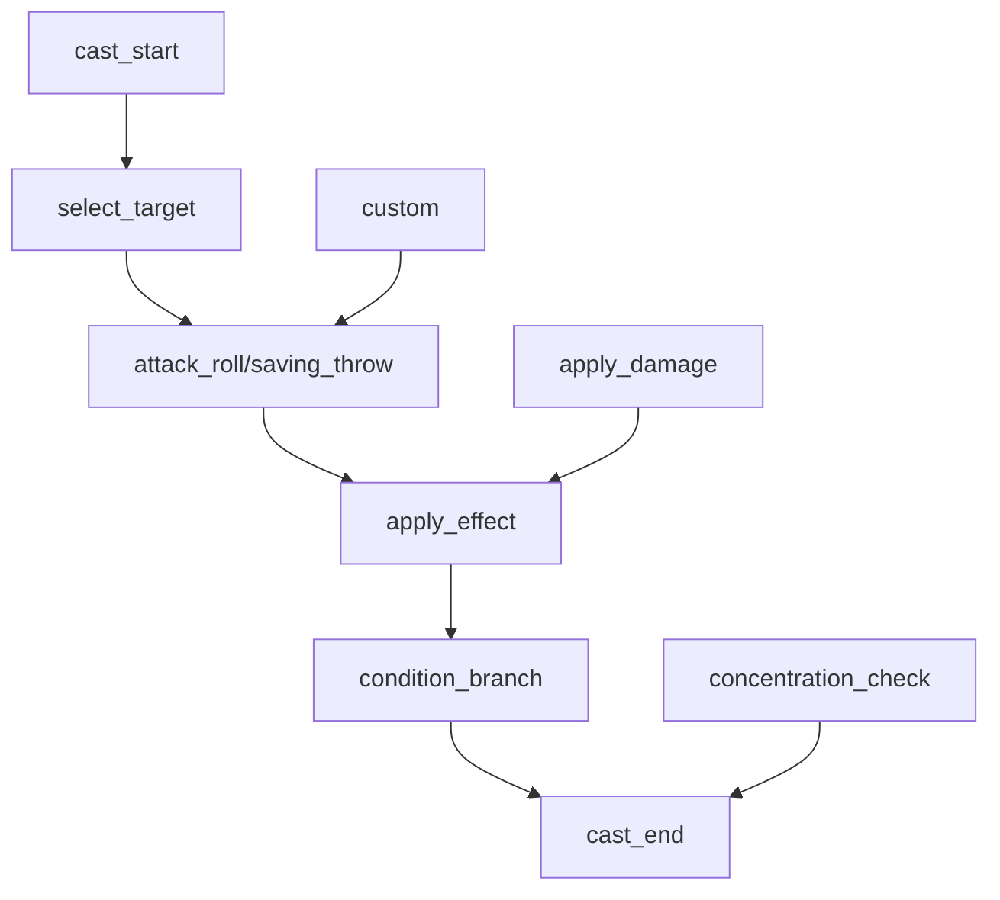

# 节点类型总览

## 概述

D&D DSL 编译器使用 10 种核心节点类型处理法术流程，每个节点都有特定的功能和配置项。本文档详细说明每个节点的功能、配置项、调用方式和最佳实践。

## 节点分类

### 主要节点（当前使用）
1. **cast_start** - 智能施法开始节点
2. **select_target** - 目标选择节点
3. **saving_throw** - 豁免检定节点
4. **apply_effect** - 效果应用节点
5. **condition_branch** - 条件分支节点
6. **cast_end** - 施法结束节点
7. **attack_roll** - 法术攻击节点
8. **concentration_check** - 专注检定节点
9. **custom** - 自定义节点
10. **apply_damage** - 伤害应用节点

## 节点关系图

## 节点功能说明

### cast_start - 智能施法开始
- **功能**：自动执行前置检查（成分、射程、专注等）并初始化施法上下文
- **配置**：自动检查配置、资源消耗、专注要求
- **状态**：✅ 当前主要使用
- **重要性**：法术流程智能化的关键节点

### select_target - 目标选择
- **功能**：法术的目标选择，支持多种目标类型和选择方式
- **配置**：目标类型、数量、选择条件、射程限制、区域形状
- **状态**：✅ 当前主要使用
- **重要性**：法术目标处理的关键节点

### saving_throw - 豁免检定
- **功能**：处理法术的豁免检定逻辑，包括属性选择、DC计算、检定执行
- **配置**：豁免属性、DC、伤害处理、优势劣势、自动处理
- **状态**：✅ 当前主要使用
- **重要性**：法术豁免检定的关键节点

### apply_effect - 效果应用
- **功能**：将法术效果应用到目标角色上，包括状态效果、临时HP、属性变化
- **配置**：效果类型、名称、持续时间、强度、叠加性、专注要求
- **状态**：✅ 当前主要使用
- **重要性**：法术效果结算的关键节点

### condition_branch - 条件分支
- **功能**：根据条件执行不同的分支逻辑，支持复杂的条件判断和分支处理
- **配置**：条件表达式、分支配置、默认分支、超时时间
- **状态**：✅ 当前主要使用
- **重要性**：法术流程控制的关键节点

### cast_end - 施法结束
- **功能**：完成法术的收尾工作，包括清理资源、触发事件、更新冷却时间
- **配置**：资源清理、事件触发、冷却更新、结果记录
- **状态**：✅ 当前主要使用
- **重要性**：法术流程收尾的关键节点

### attack_roll - 法术攻击
- **功能**：执行法术攻击检定，包括攻击检定、目标AC检查、命中判定、伤害计算
- **配置**：攻击加值、目标AC、暴击范围、优势劣势、自动命中/未命中
- **状态**：✅ 当前主要使用
- **重要性**：法术攻击结算的关键节点

### concentration_check - 专注检定
- **功能**：施法者进行专注豁免，检定体质属性对抗DC 10或伤害半数
- **配置**：专注DC、伤害半数、自动失败/成功
- **状态**：✅ 当前主要使用
- **重要性**：持续法术流程的核心节点

### custom - 自定义节点
- **功能**：开放扩展的自定义逻辑节点，支持编写自定义代码实现复杂逻辑
- **配置**：自定义代码、输入输出模式、超时时间
- **状态**：✅ 支持自定义扩展
- **重要性**：系统扩展性的关键节点

### apply_damage - 伤害应用
- **功能**：将计算出的伤害值应用到目标角色上，处理伤害计算、AC检查、伤害类型和抗性
- **配置**：伤害值、伤害类型、攻击检定、目标AC、暴击、自动命中/未命中
- **状态**：✅ 当前主要使用
- **重要性**：法术伤害结算的关键节点

## 使用建议

### 新项目推荐
- **主要节点**：使用当前的主要节点（cast_start、select_target、saving_throw 等）
- **自定义扩展**：使用 custom 节点进行自定义扩展

### 迁移建议
- **性能优化**：定期进行性能测试和优化

### 最佳实践
- **节点选择**：根据具体需求选择合适的节点
- **配置优化**：优化节点的配置，避免不必要的复杂性
- **错误处理**：为每个节点添加适当的错误处理
- **性能监控**：监控节点的执行性能，及时优化

## 扩展指南

### 自定义节点开发
- **功能扩展**：使用 custom 节点添加新的功能
- **业务逻辑**：在 custom 节点中实现复杂的业务逻辑
- **集成测试**：为自定义节点编写完整的测试用例
- **文档维护**：为自定义节点编写详细的文档

### 节点优化
- **性能优化**：优化节点的执行性能
- **内存优化**：优化节点的内存使用
- **并发处理**：支持节点的并发处理
- **缓存优化**：优化节点的缓存机制

### 维护建议
- **版本管理**：为节点版本管理建立规范
- **文档更新**：及时更新节点的文档
- **测试覆盖**：确保节点有完整的测试覆盖
- **监控告警**：为节点添加监控和告警机制

## 总结

D&D DSL 编译器的节点系统提供了完整的法术流程处理能力，通过10个核心节点，可以处理各种复杂的法术场景。主要节点提供了现代化的智能化处理能力，开发者可以根据具体需求选择合适的节点，并通过自定义节点进行功能扩展。